<p align="center">
  
</p>

<h1 align="center">栖点 / Perch</h1>
<p align="center">把引擎、扩展和习惯，安放在自己的工作空间。</p>
<p align="center">
  <a href="https://github.com/XVSHIFU/perch/releases">下载</a> ·
  <a href="#快速开始">快速开始</a> ·
  <a href="#从源码构建">从源码构建</a> ·
  <a href="https://github.com/XVSHIFU/perch/issues">反馈问题</a>
</p>

栖点是面向 **Windows x64** 的 DSH / Pi 桌面工作环境管理器。你可以为不同项目建立独立实例，复用模型连接，选择引擎版本与扩展，也可以把常用配置整理成可分享的整合包。

**v1.0.0 · 首个正式版本。** 栖点负责管理和启动工作环境，实际对话与开发在 DSH / Pi 工作台中进行。

## 界面预览

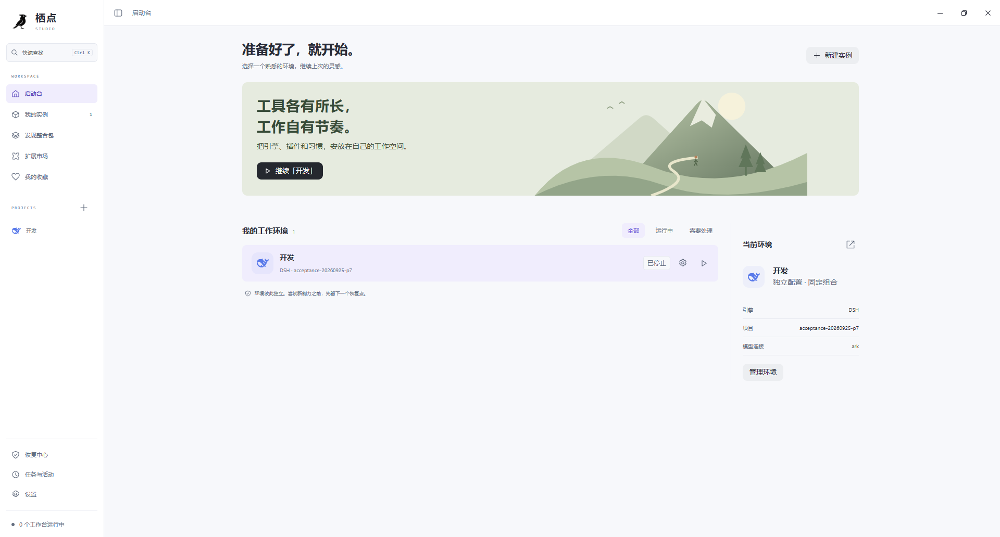

## 栖点能做什么

### 为每个项目保留自己的环境

实例分别保存组合、配置和会话。模型连接只配置一次，可以绑定到多个实例；切换项目时不用反复填写 API Key。侧栏保留实例入口，折叠后也能快速切换。

可以克隆实例试用新组合，利用恢复点回退配置，或在恢复中心找回已删除的实例。

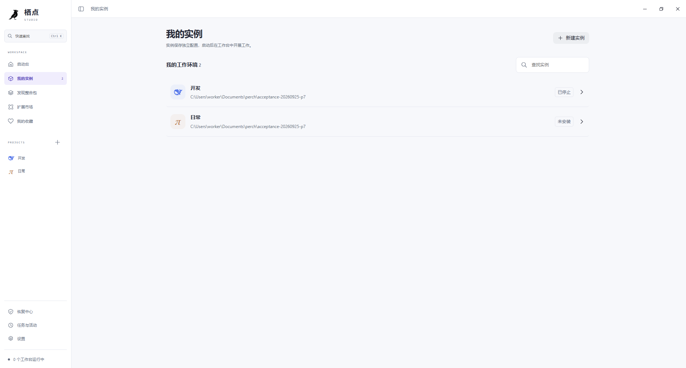

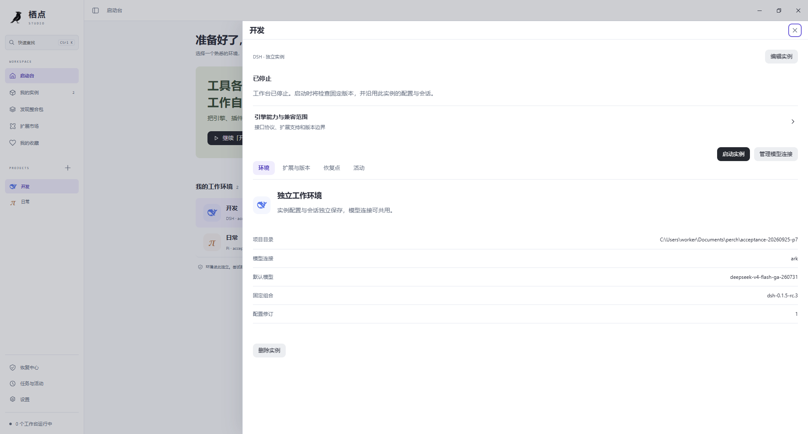

### 挑选组合，也能制作自己的组合

从用途明确的整合包开始，或修改模板搭配自己的引擎和资源。组合支持编辑、精确依赖锁定、导入导出，再用于创建实例。

版本选择位于创建流程和实例版本管理中。历史版本与预览版可以进入目录，安装前会解析相应工件和兼容要求；版本变更可先查看差异。

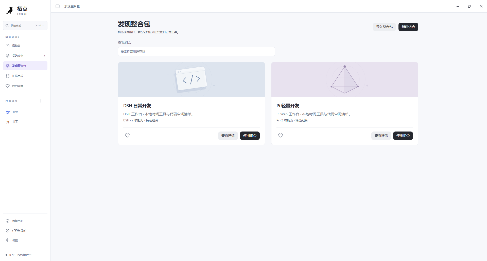

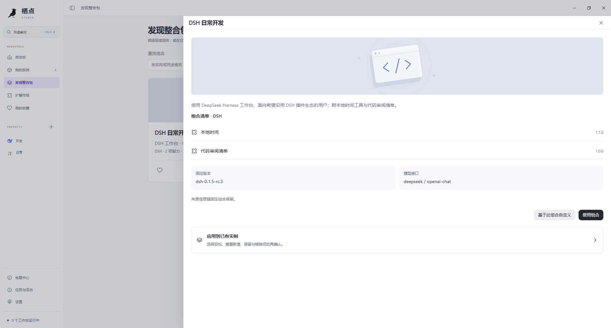

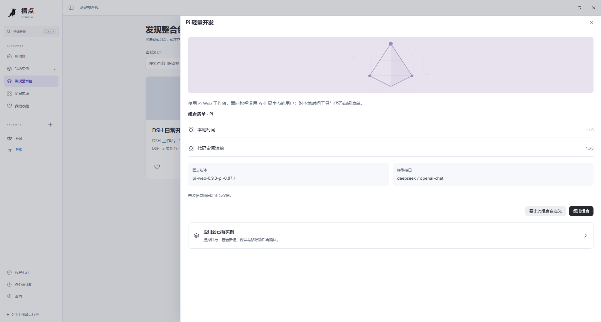

### 在同一个市场里查找扩展与 Skills

资源来源包括 Pi 官方目录、npm、DSH 工坊和 GitHub 社区。按引擎和资源类型筛选，查看内容后选择安装目标，预览变更再安装。

插件、Skills、主题、桌宠和预设按各自生态处理。资源声明不支持当前环境时会说明原因，不会把两种引擎的扩展当作可以直接互装。

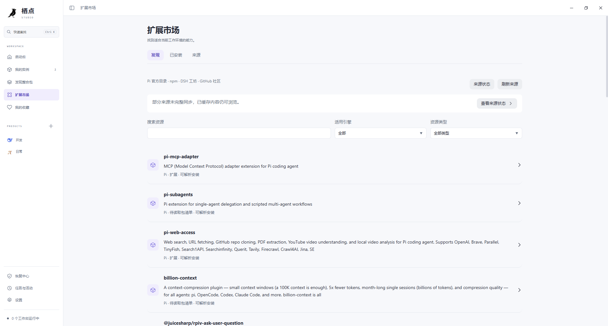

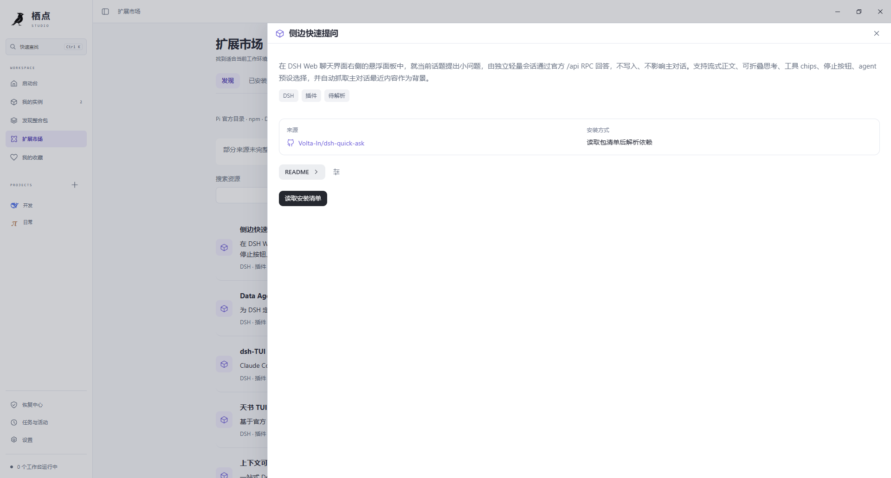

读取清单后，选择安装目标并解析组合，再确认安装。

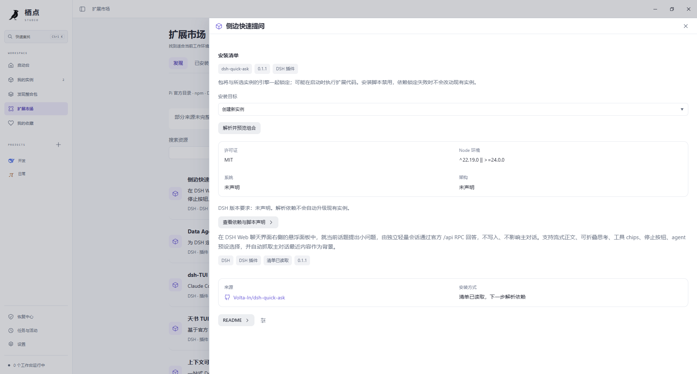

### 读清介绍，再决定是否安装

软件内置带时间的公开目录快照，首次打开即可浏览，仍可手动刷新或继续同步。来源网页在原生抽屉中打开；README 优先作者提供的中文版，支持语言切换、图片、表格与章节目录。

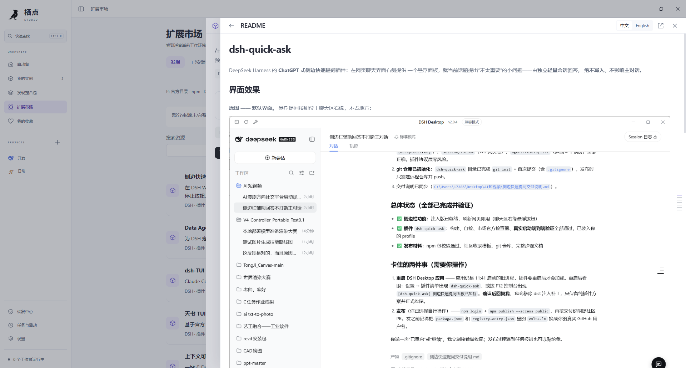

也可以在来源抽屉中浏览上游网页，返回后继续查看资源。

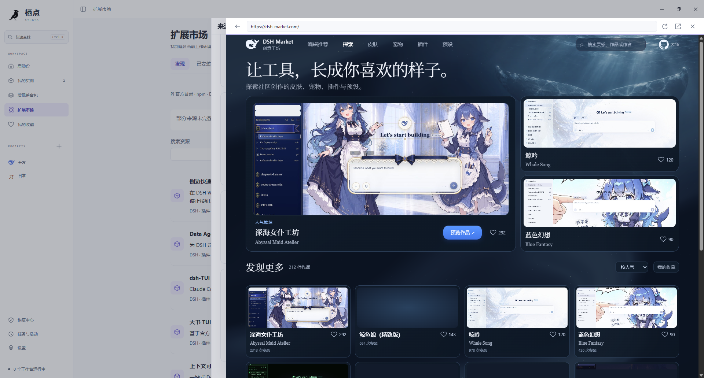

## 快速开始

### 1. 准备运行环境

| 项目 | 当前要求 |
| --- | --- |
| 系统 | Windows x64 |
| 网页运行时 | Microsoft Edge WebView2 |
| 引擎运行环境 | Node.js **24.18.0**、npm **12.0.2**，可从命令行访问 |
| 模型服务 | 自己的 API 地址、模型和 API Key |

当前安装流程会检查 Node.js 与 npm 的上述精确版本，并非任意版本都可替代。模型服务按所选引擎支持的协议配置；栖点本身不提供模型额度。

### 2. 下载栖点

前往 [Releases](https://github.com/XVSHIFU/perch/releases) 下载 Windows x64 版本：

- **安装包**：用于安装和后续升级。
- **独立 EXE**：解压发行 ZIP 后直接运行，无需安装栖点；仍需上表中的运行环境。

独立 EXE 的数据也保存在用户应用数据目录，**不是将所有数据随文件夹携带的便携模式**。

### 3. 创建第一个实例

1. 打开“设置 → 模型连接”，添加连接和模型。同一连接可以供多个实例复用。
2. 点击“新建实例”，或从“发现整合包”选择组合。
3. 选择项目文件夹、引擎版本和模型连接，保存实例。
4. 安装所需组件，然后启动工作台。DSH / Pi 工作台会在默认浏览器中打开。
5. 需要添加资源时，进入“扩展市场”，确认目标实例与变更摘要后安装。更改运行中的实例前先停止工作台。

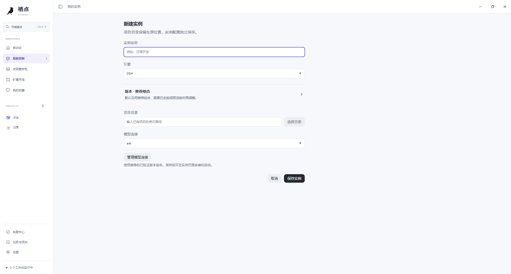

## 数据、升级与恢复

- 实例、组合、会话和缓存位于 `%APPDATA%/dev.perch.studio.lab/workspace/`。
- API Key 保存在 **Windows 凭据管理器**；多个实例通过引用复用连接。
- 升级沿用安装名称 `Perch Studio Lab` 和应用标识，以读取已有数据。不要为升级手动删除工作空间。
- 卸载默认保留数据；只有主动选择删除应用数据才进入额外确认。外部项目文件不随实例删除。
- 分享整合包不会导出模型密钥；自行加入的文件仍需在分享前检查内容和许可。
- 暂无应用自动更新，后续版本从 Releases 下载。

## 当前范围

- 首版发布 Windows x64，尚未提供 macOS / Linux 安装包。
- 目录收录不等于所有历史版本、插件或主题都通过了运行验证。以安装前的兼容判断和资源自身要求为准。
- 内置目录是快照，部分来源尚未完整收录；引擎和扩展首次安装仍需下载工件。来源同步失败时保留已有可用缓存。
- DSH / Pi 工作台在默认浏览器中打开；内嵌网页用于来源浏览。
- 当前发行文件未代码签名；干净 Windows 环境与所有第三方资源组合未做完整验证。

## 从源码构建

技术栈：**Tauri 2 + Rust + React + TypeScript**。

除运行环境外，还需要 Rust stable（MSVC 工具链）、Visual Studio C++ 桌面构建工具与 Windows SDK。

```powershell
git clone https://github.com/XVSHIFU/perch.git
cd perch/app
npm ci
npm run desktop:dev
```

发行构建：

```powershell
npm run desktop:build
```

产物位置：

- `app/src-tauri/target/release/perch-desktop.exe`
- `app/src-tauri/target/release/bundle/nsis/`

请使用 Tauri 构建入口，不以裸 `cargo build --release` 交付桌面程序。`app/build-windows.ps1` 可依次安装依赖、运行默认测试并构建；GitHub Actions 也提供手动 Windows 构建。

默认测试不自动安装 DSH / Pi 或请求模型；依赖本机引擎夹具的集成测试需显式启用。更多说明见 [app/README.md](app/README.md)。

## 反馈与参与

欢迎在 [Issues](https://github.com/XVSHIFU/perch/issues) 提交问题或建议。反馈时请附上栖点版本、Windows 版本、使用的引擎及版本、复现步骤与相关日志；请先移除 API Key 和私人文件内容。

开发约定见 [AGENTS.md](AGENTS.md)，实施计划与已有边界见 [docs/03-IMPLEMENTATION-PLAN.md](docs/03-IMPLEMENTATION-PLAN.md)。

## 许可证与致谢

栖点代码采用 [MIT License](LICENSE)。

感谢 DSH、Pi、Tauri、React、marked 和 Lobe Icons 等上游项目。第三方引擎、资源与商标归各自作者所有，适用各自的许可证；详见 [第三方说明](app/THIRD_PARTY/README.md)。

## Friends

- [Linux.Do](https://linux.do/) — A new ideal community
