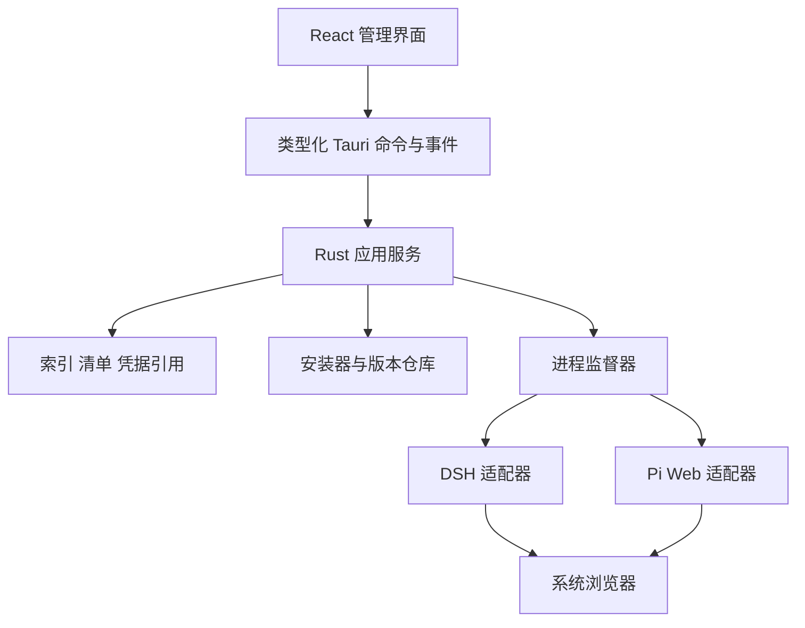

# 02 目标架构（设计规格，尚未全部实现）

## 1. 技术决策

沿用单仓库单桌面应用。React 只管理交互与展示，Rust 管理受控本机能力和真实状态。引擎/Web 使用各自 Node 运行时与进程，第一版不重写聊天工作台，也不把上游网页直接当成具有 Tauri 权限的主窗口。

前端沿用 CSS 与 TypeScript；无须为了重构引入完整 UI 框架。可按焦点管理需求局部使用成熟的 dialog/select 原语。业务服务用类型化 gateway；页面不直接访问磁盘、shell 或密钥。Rust 使用异步任务处理耗时 IO；日志采用结构化记录、限流和轮转，避免每一行都触发全局 React 更新。

拟用 SQLite 存索引和任务账本，JSON 存可导出清单/锁文件；数据库是状态索引，manifest 是可重建的安装事实。密钥由系统凭据服务保存（Windows Credential Manager 或经验证的等效平台实现），不存 localStorage 或导出包。具体 crate 在 P0/P2 选择并锁定，当前包未伪造已安装的依赖。

## 2. 进程与职责

| 模块 | 负责 | 不负责 |
| --- | --- | --- |
| DesktopShell | 窗口、托盘、文件选择、退出协调、单实例启动 | 插件业务解析 |
| InstanceService | 实例 CRUD、项目绑定、克隆、状态聚合 | 假造健康状态 |
| RuntimeStore | 运行时/包按摘要缓存，引用计数，离线复用 | 修改用户全局 Node |
| Installer | 下载、摘要、暂存、解包、依赖安装、原子激活 | 执行来自清单的任意命令文本 |
| AdapterRegistry | DSH 与 Pi 的配置、命令、能力差异 | 将所有生态插件当成同一种格式 |
| ProcessSupervisor | 进程树、端口、健康、退出码、日志、重启恢复 | 按进程名扫杀机器进程 |
| PackService | recipe 解析为固定 profile，预览变更、兼容检查 | 将未验证版本标成推荐 |
| SnapshotService | 受管配置和锁文件的快照、恢复事务 | 自动回滚用户项目 Git 改动 |
| CatalogService | 已审核来源、平台/版本元数据、缓存目录 | 把 GitHub topic 当作安装授权 |

首版管理器是进程所有者，不另加常驻系统服务。收起到托盘仍在运行；真正退出执行停止流程。管理器异常退出时，通过 Windows Job Object 等机制避免子孙进程遗留。若某上游会 detach，须测试其是否仍受 Job 管理；无法保证时不能承诺退出清理。将来才考虑独立 daemon。

## 3. 建议代码位置

| 路径（相对 app） | 内容 |
| --- | --- |
| src/app | AppShell、路由、主题、全局错误边界 |
| src/components | 列表、抽屉、弹窗、状态条、图标 |
| src/features/{instances,packs,plugins,recovery,settings} | 页面与领域交互 |
| src/services | DesktopGateway、DemoGateway、查询与事件订阅 |
| src/domain | 与 contracts 对齐的类型和展示映射 |
| src/fixtures | 演示数据，发布正式模式不默认注入 |
| src-tauri/src/commands | 输入校验、调用服务、返回稳定 DTO |
| src-tauri/src/services | 安装、实例、快照、目录、任务 |
| src-tauri/src/adapters/{dsh,pi} | 上游版本相关行为 |
| src-tauri/src/platform/{windows,unix} | 进程组、路径、凭据等平台差异 |
| src-tauri/src/storage | DB 迁移、manifest、事务恢复 |
| src-tauri/src/runtime | supervisor、端口、健康、日志 |

无需第一阶段就建立空模块大全；随着真实切片实施逐步拆出。

## 4. 数据与目录

使用 Tauri/系统 API 获取 per-user app data、cache、log 路径，不硬编码用户目录。建议逻辑布局：

| 相对数据根路径 | 内容 |
| --- | --- |
| state.sqlite | instances、profiles、tasks、snapshots、catalog_cache、schema_migrations |
| instances/{uuid}/manifest.json | 实例描述、目标 profile、项目引用 |
| instances/{uuid}/lock.json | 精确版本、依赖锁摘要、来源、工件摘要、适配器版本 |
| instances/{uuid}/config、agent-data | 该实例配置、会话及上游受管数据 |
| instances/{uuid}/logs | 脱敏的有界日志 |
| instances/{uuid}/snapshots/{uuid} | 快照描述、配置副本、被引用工件摘要 |
| store/{platform}/{sha256} | 不可变运行时/工件；可写 node_modules 不能盲目跨实例共享 |
| staging/{operationId} | 暂存安装事务，失败可清理 |
| catalog/ | 缓存来源目录和验证证据 |

外部 workspace 是用户选定的项目，不默认复制到实例目录。克隆默认复制受管配置并引用同一 workspace，UI 必须明确可能同时修改同一项目；用户可选择新项目路径。隔离配置不等于隔离文件访问。

数据库运行状态只作上次观测缓存。重启后执行 reconciliation，核对 ownership token、启动时间、进程句柄/可执行路径、endpoint；仅 PID 不足以认领或终止进程。首次加载前端应显示 discovering，不先显示“已就绪”。

P2 已实现边界：SQLite v1 保存配置事实和任务，事务内登记 journal 后生成 manifest/lock；文件写入失败保留待恢复记录，重开或重试时从已提交配置补齐文件。当前 manifest 是一致性输出，不支持脱离数据库自动导入重建；外部导入留给 P5。尚未接入安装与 supervisor，所以后端统一返回 not_installed，不从浏览器缓存推断运行。连接凭据采用版本化系统凭据引用及清理意图表，失败不覆盖旧密钥，恢复时清理未引用条目。

## 5. 适配器能力契约

适配器至少提供 inspectProfile、resolveInstallPlan、materializeConfig、buildLaunchSpec、probeHealth、requestGracefulStop、listExtensions、validateExtension、applyExtensionChange、snapshotScope。

LaunchSpec 由受信适配器生成：可执行文件绝对路径、参数数组、受控 cwd、子进程环境、日志规则、预期 endpoint、进程组策略。外部整合包不得传入 shell 命令、任意 executable、PowerShell 脚本。避免拼接 `cmd /c` 或全局 `npm -g`；Windows 的 .cmd 启动差异必须实际处理。

能力声明包括 isolatedConfig、customPort、noAutoOpen、healthProbe、extensions、gracefulStop、nativeWindows。unsupported 在 UI 中有明确原因，不能自动切换为全局配置。能力由具体 profile 验证，不由引擎名称永久决定。

Pi Web 可能在单个服务中通过 SDK 承载 Pi，不要先假设必须同时拉起两个守护进程；从所选发布版本的依赖与入口确认，再决定 supervisor 的进程树。DSH 内置 Web 与独立 Web 都在 profile 中显式表示。

## 6. 生命周期、并发与真实状态

安装：missing → resolving → downloading → verifying → staging → ready；失败进入 failed，保留原因和可恢复事务。取消有明确检查点，激活阶段不可留半成品。

运行：stopped → starting → healthy → stopping → stopped；启动错误/运行中崩溃进入 failed；进程活但健康异常可为 degraded。安装状态和运行状态分开建模，不再用一个 ready 字段包办。

启动顺序：获取实例操作锁 → 验证锁文件/配置 → 确认项目路径 → 选择端口 → 创建受管进程 → 有界等待健康 → 记录端点与所有权 → 发布 running 事件 → 用户触发浏览器打开。

端口预检查存在竞争，必须处理 bind 失败后有限次数换端口重试。健康检查至少验证 HTTP 内容/协议指纹与子进程存活，不能只看 TCP 能连。未登录模型服务是 needsConfiguration，不应简单认定服务器启动失败。

停止：发上游支持的温和停止请求，超时后终止本实例进程树；核对端口释放。更新、恢复、插件修改与运行互斥，首版统一要求停止后修改。重复点击启动/安装使用 idempotencyKey 和实例锁。

前端进入页面先取全量状态，再接收带 revision/sequence 的事件；事件缺口、窗口重载后重新同步。任务用 operationId、阶段、进度、可取消标记和结果，不能用 setTimeout 生成真实进度。

## 7. 版本、插件和整合包

区分三个对象：Recipe（用户意图）、ValidatedProfile（已测试组合）、ResolvedLock（该次安装的精确解析）。安装前必须从 recipe 解析出可用 profile，再形成不可歧义 lock。

Profile 固定 OS/arch、运行时版本、引擎版本、Web 版本或 bundled 标记、扩展版本/commit、来源摘要、适配器版本与测试记录。SemVer 范围只是候选筛选；生产安装使用精确版本。Web 与引擎相容不是两个下拉列表的任意笛卡尔积。

Extension 分为 dsh-plugin、pi-extension、skill、mcp-server、web-ui，分别有引擎映射和配置方式。Skill 内容可移植也要验证发现路径和调用行为；MCP 服务仍是可执行代码，首版可延后或限制白名单。声明的权限不是强制安全沙箱。

首版目录采用项目维护的静态 JSON 与已验证配方，能离线读缓存。dsh-market/GitHub topics 等仅是发现来源，不能假定有稳定可用 API。为后续开放投稿预留来源/维护者/许可证/更新时间/兼容性证据，但不先开发完整云端市场。

## 8. 安装与恢复事务

安装：解析来源 → 下载至 staging → 校验摘要与来源策略 → 检查归档路径（绝对路径、..、符号链接/Windows reparse point）与大小 → 受控安装依赖 → 写 lock → 健康/配置探测 → 原子切换 active revision → 提交索引。

哈希用于内容一致性，不自动证明发布者可信。需要下载/执行脚本的组件在安装计划中说明；不要简单对所有包禁用脚本后声称可用，也不要允许未知包静默执行。

DB 与文件系统没有天然同一事务：使用 operation journal 和激活标记，开机恢复根据阶段回滚或补交。旧 revision 在新版本通过验证前保持可用。

快照默认包括受管配置、锁文件、扩展启用状态和工件引用；不包括凭据、项目源代码、聊天内容，除非用户明确选择并显示范围。恢复前先停服务、备份当前、验证目标工件可用，暂存后切换。被快照引用的缓存不能被 GC 删除；离线缺工件时明确阻止恢复，不静默换版本。

导出默认是便携清单，剔除密钥、机器绝对路径、日志、会话、auth 文件。导入 schema/version 校验，未知字段/来源/协议拒绝或明确降级，不支持 embedded 任意脚本。第一次不直接迁移原型 localStorage 到生产数据库；提供显式“导入演示清单”，过滤示例版本与故障数据。

## 9. 凭据和边界

实例配置独立，但可以共用模型连接。上游原生工作台登录仅作为 P1 的早期验证方式；正式日常体验是在栖点配置一次，创建实例时选择，默认沿用已有兼容连接。

设置中增加“模型连接”页面。连接保存名称（如“DeepSeek 官方”“我的中转站”）、服务商、接口协议、API 地址、默认模型和 secretRef；Key 由桌面端存入平台凭据服务，不回传明文供页面展示。实例仅保存 connectionId，特殊需求可创建独立连接并绑定。

| 操作 | 行为 |
| --- | --- |
| 首次使用 | 添加一次模型连接；无连接时引导配置 |
| 新建实例 | 默认选择已有兼容连接，允许切换；没有兼容项时说明原因 |
| 克隆实例 | 沿用连接引用，不复制 Key；实例其他配置与会话仍独立 |
| 修改 Key | 集中更新一次，引用该连接的实例下次启动读取新值；运行中实例提示待重启，不暗中改写 |
| 独立凭据 | 为目标实例建立并选择独立连接，不改变其他实例 |
| 分享整合包 | 仅声明协议/模型能力需求，不含 Key、secretRef 或本机 connectionId；导入时选择本机连接 |

DSH/Pi 适配器将连接转换为各自接受的配置。共享同一连接前必须核对协议和模型兼容性；不兼容时说明原因并允许选择其他连接，不能靠反复要求输入相同 Key 解决。必须验证上游接受环境注入还是要求落盘，不承诺凭据完全不落盘。上游工作台手动修改的凭据不自动回写或覆盖共享连接。删除被引用的连接前要求替换绑定或阻止删除，不静默改用其他连接。

子进程环境按需求构造，不无差别继承开发机全部环境变量；允许经用户配置的代理，但本机端点应绕过代理。密钥不放命令行参数、活动日志或 URL；处理上游日志脱敏。需要落盘的上游凭据保存在实例私有区域并限制权限，禁止进入快照/导出。

工作台仅回环绑定，默认不提供局域网入口。前端打开端点必须来自 supervisor 登记的运行实例，不接受任意浏览器 URL。若上游没有鉴权/Origin 校验，记录本机请求风险并验证其防护；随机端口不等于鉴权。Tauri 主窗口权限不授予 Agent 网页。

## 10. 跨平台策略

共享 React、domain、清单/解析、安装事务和大部分 Rust 服务。平台模块处理 Job Object/进程组、可执行名称、凭据后端、系统路径、托盘、WebView 和安装器。每个平台重新建立运行时与插件工件矩阵、原生依赖构建及用例，不把 Windows 安装包中的 Node 原样复制到其他系统。
